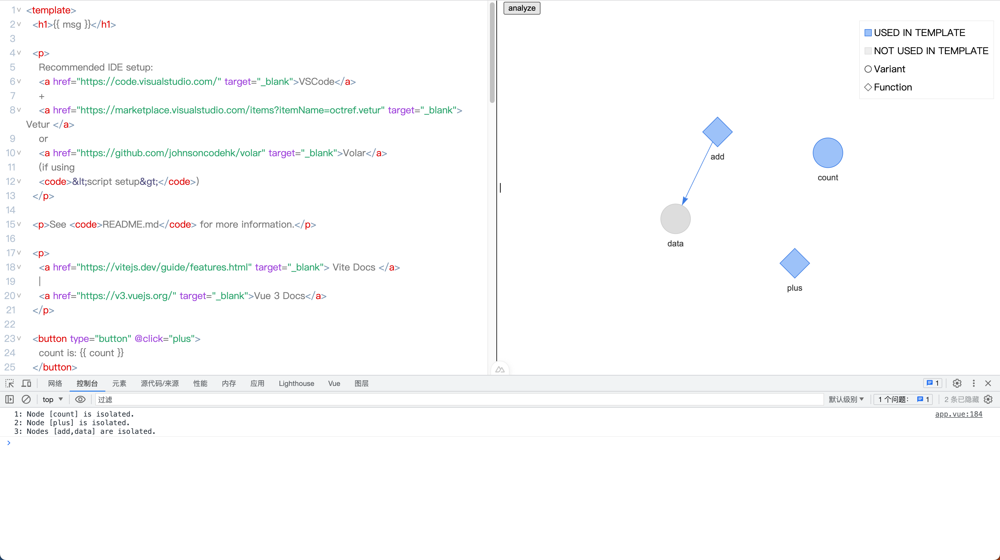

[](https://www.npmjs.com/package/vue-hook-optimizer)
<a href="https://marketplace.visualstudio.com/items?itemName=zcf0508.vue-hook-optimizer-ext" target="__blank"></a>

[中文文档](./README_cn.md)

This is a tool to analyze your `vue` code. Viste [hook.huali.cafe](https://hook.huali.cafe) or try the vscode extension [vue-hook-optimizer-ext](https://marketplace.visualstudio.com/items?itemName=zcf0508.vue-hook-optimizer-ext).

## Install And Run Playground

```bash
# clone the repo then install the dependencies
pnpm install
# run the playground
pnpm run play
```

Open the browser and visit `http://localhost:3000/`.


## How To Use

1. paste your `vue` code into the editor

~~Up to now, it only supports the code with `<script setup>` syntax block.If your code use `options api`, it's not working at the moment.~~

2. click `Analyze` button

The tool will analyze the code, and show the relations between the variables and the methods. This is a simple demo.



## Motive

Sometime we have to refactor the code, maybe there are thousands of lines of code in one file. And it is too complex and hard to understand.

So I want to build a tool to help us analyze the code, and find the relations between the variables and the methods. We can find out some variables are isolated, and some methods are over-association, and then we can refactor them.

## Development Plan

- [ ] add ~~node type~~ (has added `var` and `fun` types) and more info
- [x] provide some suggestions for optimization
- [x] support `options api`
- [x] [vscode extension](./packages/vscode)

## Contribution

Any contributions are welcome. 

## Sponsor Me

If you like this tool, please consider to sponsor me. I will keep working on this tool and add more features.


## License

MIT
