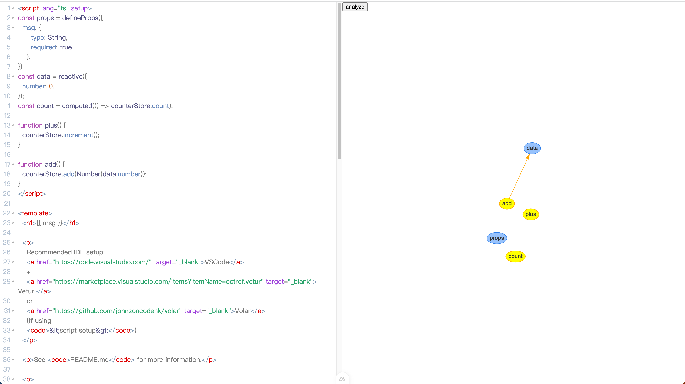

[中文文档](./README_cn.md)

这是一个用来分析 `vue` 代码的工具。

## 安装和运行

```bash
# 克隆仓库并安装依赖
pnpm install
# 运行 playground
pnpm run play
```

打开浏览器并访问 `http://localhost:3000/`.


## 如何使用

1. 把你的 `vue` 代码粘贴到编辑器中

目前只支持使用 `<script setup>` 编写的代码。如果你还在使用 `options api` ，那这个工具暂时还无法正常工作。

2. 点击 `Analyze` 按钮

这个工具会分析 `setup block` 和 `template block`，并展示变量和方法之间的关联关系。这是一个简单的示例。



## 动机

有时我们不得不重构代码，可能一个文件里有成千上万行代码。太复杂难以理解。

所以我想开发一个工具来帮助我们分析代码，并找出变量和方法之间的关联关系。我们可以发现一些变量是孤立的，一些方法是过度关联的，然后我们可以重构它们。

## 支持我

如果你喜欢这个工具，请考虑支持我。我将继续努力开发这个工具，并添加更多功能。

